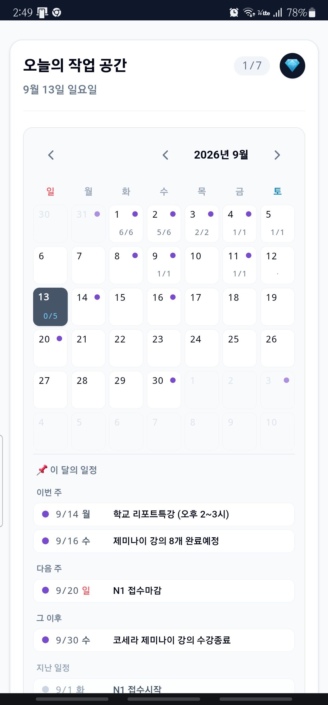
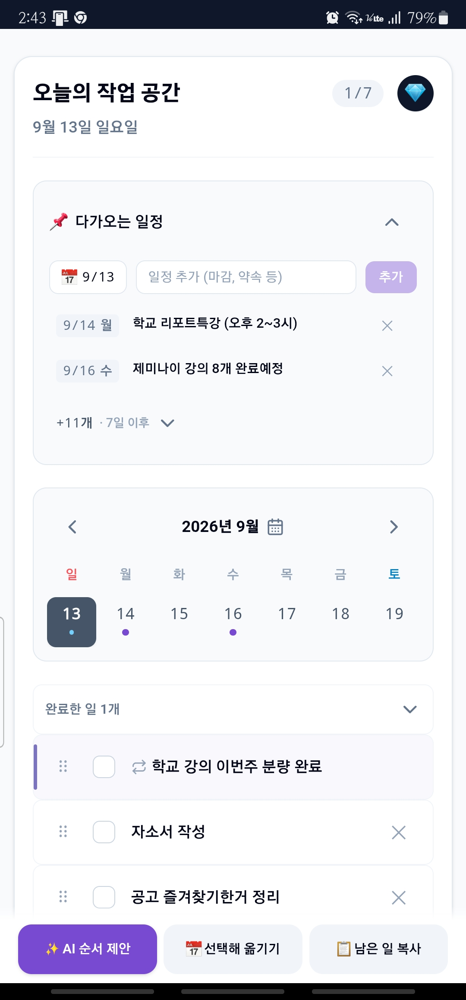
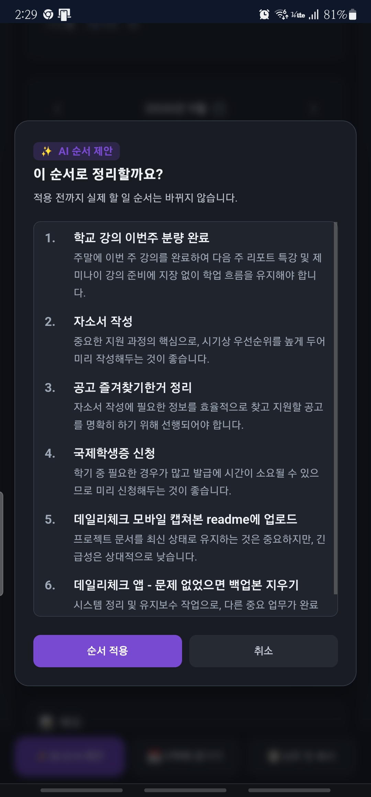

# Daily Check

> 남은 일을 복사해 AI에 붙여넣는, 하루 단위 체크리스트

[데모 바로가기](https://daily-check-lime.vercel.app)

<table>
  <thead>
    <tr>
      <th width="33%">월 달력</th>
      <th width="33%">주간 뷰</th>
      <th width="33%">우선순위 추천</th>
    </tr>
  </thead>
  <tbody>
    <tr>
      <td align="center">
        
      </td>
      <td align="center">
        
      </td>
      <td align="center">
        
      </td>
    </tr>
  </tbody>
</table>

## 왜 만들었나

PC와 폰을 오가며 하루 할 일을 관리하고 싶었고, 막힐 때마다 AI에게 목록을 그대로 붙여넣어 상담하는 게 실제 작업 흐름이었습니다. 기존 투두 앱들은 이 흐름을 지원하지 않아 직접 만들었습니다. 목표는 단순합니다 — **오늘 할 일을 3초 안에 적고 체크한다.**

혼자 쓰려고 시작했지만, 8월 초부터 지금까지 매일 열어 쓰면서 실사용에서 나온 문제만 골라 다듬어왔습니다.

## 핵심 결정 몇 가지

- **3-way 병합** — 여러 기기에서 동시에 수정해도 서로 다른 항목의 변경은 자동으로 합쳐집니다. 같은 항목을 양쪽에서 다르게 고친 경우에만 충돌로 표시합니다.
- **반복 일정 vs 루틴(반복 할 일)** — 둘을 다른 데이터로 설계했습니다. 일정 반복은 날짜에 표시만 하면 되지만, 할 일 반복은 완료 여부를 날짜별로 독립적으로 관리해야 합니다. 이월과 연속 기록(스트릭)을 두지 않는 방식으로, 습관 추적 앱이 되지 않으면서도 반복 항목을 지원하도록 설계했습니다.
- **폰이 주 사용 기기** — 데스크톱 hover를 전제한 UI 패턴을 걷어내고, 모바일 키보드·뒤로가기·드래그 충돌 같은 문제를 실사용 중에 하나씩 고쳤습니다.
- **기능을 판단하는 기준** — "이게 없으면 앱을 못 쓰는가"를 기준으로 삼아, 통계·태그·알림 같은 기능은 의도적으로 만들지 않았습니다.

## 기술 스택

- React 19 + TypeScript
- Vite + Tailwind CSS (CSS 변수로 다크모드 대응)
- Supabase Auth / DB / Realtime / Edge Functions
- Gemini 2.5 Flash — AI 순서 제안, Edge Function 경유(API 키 은닉 목적)
- Vercel 배포 (정적 배포, 상시 구동 서버 없음)

## 로컬 실행

```bash
npm install
npm run dev -- --host
```

환경변수는 `.env.local`에 둡니다.

```env
VITE_SUPABASE_URL="https://your-project.supabase.co"
VITE_SUPABASE_ANON_KEY="your-anon-key"
```

## 폰에서 테스트

`npm run dev -- --host` 실행 후 Vite가 표시하는 `Network` 주소로 접속합니다.

예: `http://192.168.0.10:3000`

Supabase 로그인 테스트를 하려면 이 Network 주소를 Supabase Auth Redirect URLs에 등록해야 합니다.

## 배포

`main`에 `git push`하면 Vercel이 자동 배포합니다.

```bash
git push
```

## Edge Function

Edge Function 코드는 `supabase/functions/` 아래에 기록용으로 보관합니다.

배포는 Supabase 콘솔에서 합니다. 현재 함수:

- `supabase/functions/prioritize/index.ts`

## 문서

- `docs/`: 기획서, 버전별 프롬프트, 작업 메모. 개인 사용 기록이 포함돼 있어 `.gitignore`로 관리하며 저장소에는 포함되지 않습니다
- `CLAUDE.md` / `AGENTS.md`: AI 에이전트와 협업할 때 지키는 규칙. 동일한 내용이며, 실제로 겪은 문제가 생길 때마다 하나씩 추가됩니다

## 자주 겪은 문제

- CSS 변경이 안 보이면 개발 서버를 재시작합니다.
- 코드 변경이 안 보이면 서비스 워커 해제 후 사이트 데이터를 삭제합니다.
- 브라우저 CORS 오류는 404/401이 가려진 경우가 많습니다. Edge Function은 `curl`로 직접 확인합니다.

```bash
curl.exe -i -X OPTIONS https://<project>.supabase.co/functions/v1/<name>
```

## 라이선스

개인 프로젝트로, 별도 라이선스 없이 공개합니다.
